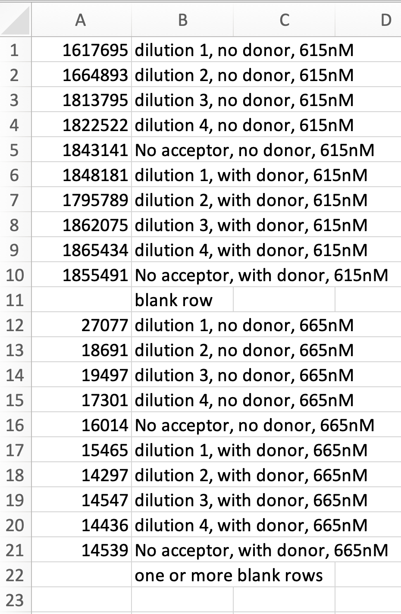

## TR-FRET Binding Data Processor (TR-FRET dataProcess)

TR-FRET dataProcess is a program designed to process raw TR-FRET data from nucleosome/protein or protein/protein binding
experiments, as performed in [Wesley <i>et al.</i> (Protein Science 2022)](https://doi.org/10.1002/pro.4339).

The program takes in TR-FRET data, performs signal correction, and calculates the binding affinity of the dataset being
tested, along with goodness-of-fit statistics. It outputs a xlsx file containing corrected data, normalized data, curve
fitting data,
and a plot of the experimental data and the fitted curves.

### Requirements

To run TR-FRET dataProcess, you will need Python (v3.8+) and :

- NumPy
- SciPy
- pandas
- OpenPyXL

You can install these required packages using pip. To do so, run the following command in the terminal:

`pip3 install numpy scipy pandas openpyxl`

### Usage

- Run from the command line by typing: 
  `python3 ./dataProcess.py`
- The program will prompt you for:
    - a path to the data (single csv file or directory containing multiple files)
    - the maximum concentration in the dataset (in mM)
    - whether the wells decrease or increase in concentration
    - whether the wells are arranged in columns or rows
    - the dilution factor used for the datapoints
- Once the data is processed, a new dataset can be provided, or type "q" to quit.

Note that you must provide a path to a single CSV file containing data for a single replicate or a directory containing
multiple CSV files where each file contains the data for a replicate. See the next section for the required format of
the raw data.

### Raw Data Format

TR-FRET dataProcess requires a specific format for the data.

If the user arranges samples for data collection as shown in the figure above, the VICTOR Nivo plate reader can
output a CSV file that has the correct input format for TR-FRET dataProcess. When exporting results choose "CSV" as the
export
format and "Plate format - only results data" as the export type when exporting results.

Alternatively, the data can be arranged in rows. In this format, the first row corresponds to the "- donor" wells and
the second
row corresponds to the "+ donor" wells. Similar to the column format, the last wells (furthest to the right) must
contain
the "no acceptor" samples. If this arrangement is used, the exported CSV file can be used without modification. However,
when processing the data enter `r` when prompted for experiment format.

If none of the formats above were used, one can create a new CSV file as described in the following figure. Shown is an
example CSV file containing a dataset with 4 dilutions. The blank row between emission at 615 nM and
emission at 665 nM is essential. Other blank cells are ignored. Note that only column A and B would be populated in
the actual input file.

### License

This project is licensed under the Creative Commons Attribution-NonCommercial 4.0 International License (CC BY-NC 4.0)
