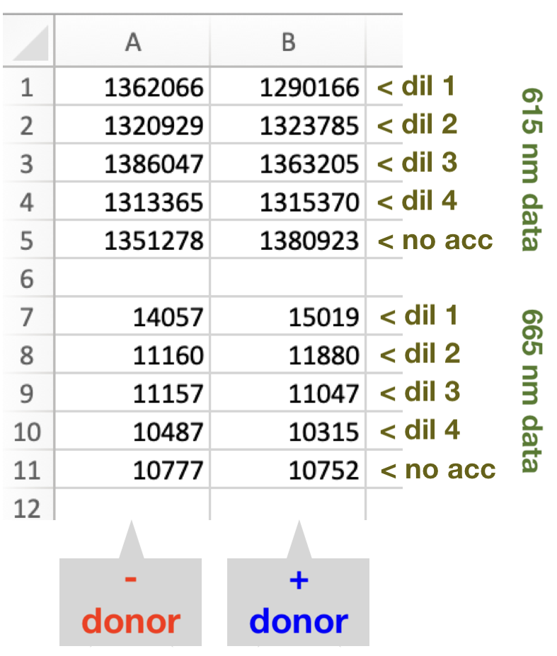

## TR-FRET Binding Data Processor (TR-FRET dataProcess)

TR-FRET dataProcess is a program designed to process raw TR-FRET data from nucleosome/protein or protein/protein binding
experiments, as performed in [Wesley <i>et al.</i> (Protein Science 2022)](https://doi.org/10.1002/pro.4339).

The program takes in TR-FRET data, performs signal correction, and calculates the binding affinity of the dataset being
tested, along with goodness-of-fit statistics. It outputs a xlsx file containing corrected data, curve fitting data,
and a plot of the experimental data and the fitted curve.

### Requirements

To run TR-FRET dataProcess, you will need Python (v3.8+) and :

- NumPy
- SciPy
- pandas
- OpenPyXL

You can install these required packages using pip. To do so, run the following command in the terminal:

`pip3 install numpy scipy pandas openpyxl`

### Usage

- Run from the command line by typing: 
  `python3 ./dataProcess.py`
- The program will prompt you for:
    - a path to the data (single csv file or directory containing multiple files)
    - the maximum concentration in the dataset (in mM)
    - whether the wells increase or decrease in concentration
    - the dilution factor used for the datapoints
- Once the data is processed, a new dataset can be provided, or type "q" to quit.

Note that you must provide a path to a single CSV file containing data for a single replicate or a directory containing
multiple CSV files where each file contains the data for a replicate. See the next section for the required format of
the raw data.

### Raw Data Format

TR-FRET dataProcess requires a specific format for the data. The data must be arranged as shown in the following example
CSV file containing a dataset with 4 dilutions and donor-only wells. The blank row between emission at 615nM and
emission at 665nM is essential, and the blank rows at the end are ignored. Note that only column A would be populated in
the actual input file.

~~If the user arranges samples for data collection as shown in the following figure, the VICTOR Nivo plate reader can
output a CSV file that already has the correct format. For data collected in this manner, choose "CSV" as the export
format and "List format - only results" as the export type when exporting results.~~

### License

This project is licensed under the Creative Commons Attribution-NonCommercial 4.0 International License (CC BY-NC 4.0)
